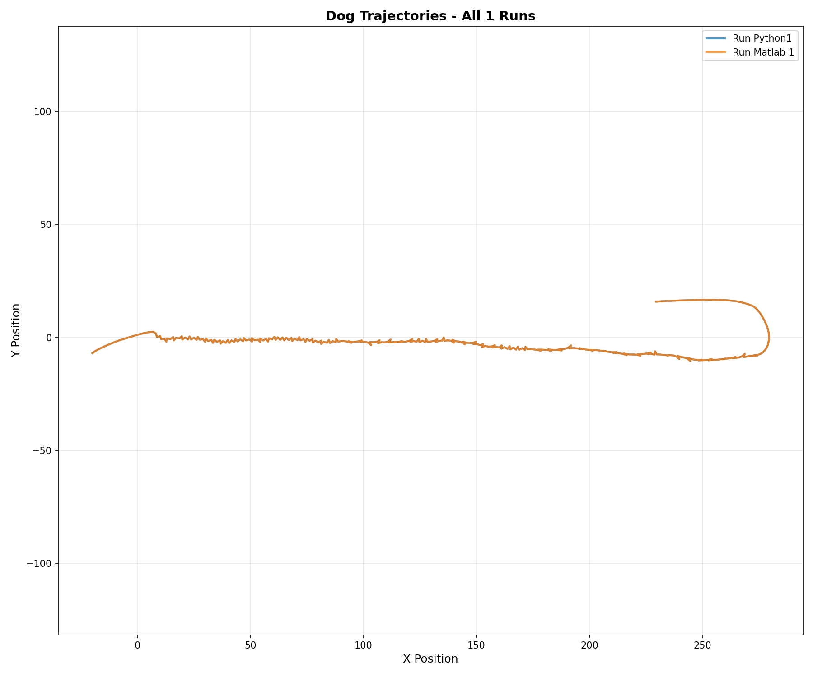

# Comparison of Matlab and Python implementations

## Objective

Our main goal is to extend and work on the Vivek et.al herding model.
Since the model is written in Matlab, and ours is written in Python, we need to compare the two.

*NOTE*: When working with `.mat` data, make sure to add `'-v7'` flag  in `save()` call so the data can be loaded in Python.

## Method 1: Dog path comparison

To make the comparison more deterministic, we need to remove randomness from the models in both implementations.

### Matlab changes

First a single run is performed, then the initial conditions are saved, this includes:
- `vel_s`
- `vel_d`
- `pos_s`
- `pos_d`
- `spd_s`

The matlab model is then changed to always use the saved initial conditions.

The following additional changes are made:
- The `K_atr`, `k_atr` and `k_alg` parameters are equalized to the same value.
- `randperm()` calls are wrapped with `sort()`, so the order of floating point operations is deterministic.
- All noise is removed, i.e.,`e*r_err` is removed from the sheep and dog position calculations.

The simulation is then run repeatedly to make sure the model is now deterministic.

### Python changes

The results from the Matlab run are loaded with `utils.py` and
the starting parameters as well as starting position is then extracted and
the `vivek_model.py` herding model is run with the same parameters.

The following changes are made to the Python model to make it deterministic:
- All noise is removed, i.e.,`e*r_err` is removed from the sheep and dog position calculations.
- `np.random.choice` calls are sorted.

The simulation is then run repeatedly to make sure the model is now deterministic.

At the end `plot_dog_py_matlab.py` is run to plot the results of both the Python and Matlab runs.
Visually we can check and see that both algorithms produce the same results.

### Correlation check

`compare_implementations.py` calculates the correlation between the two runs.

### Results

The deterministic results are 
## Method 2: Cohesion, elongation and polarization distribution comparison